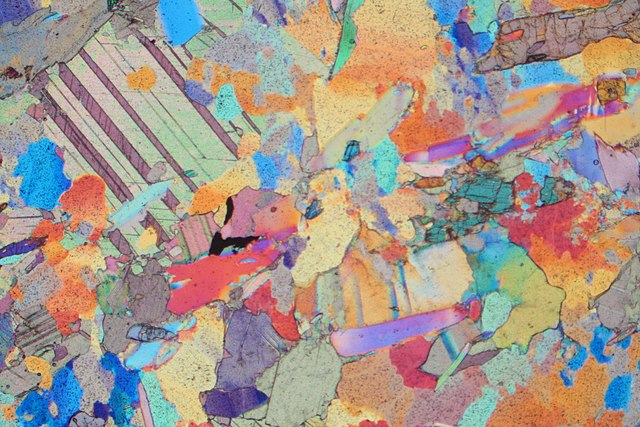
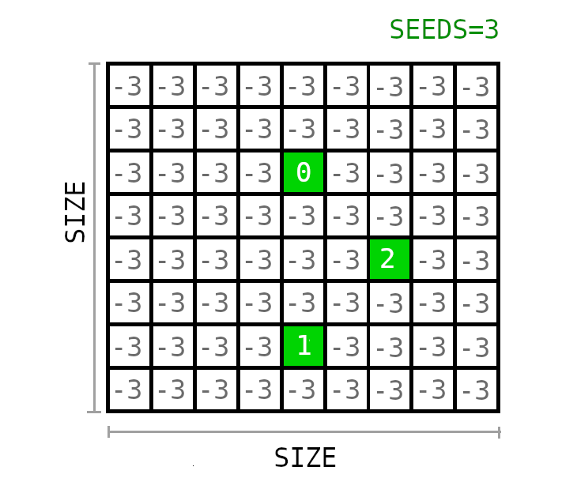
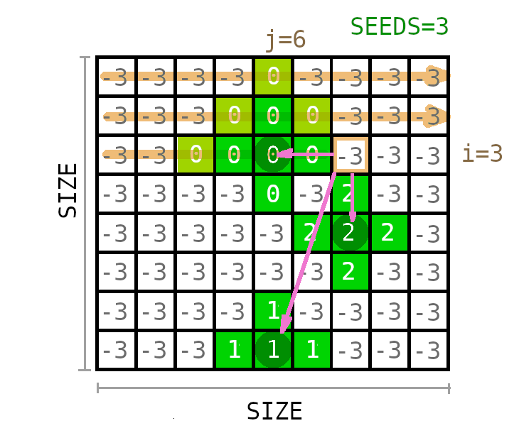
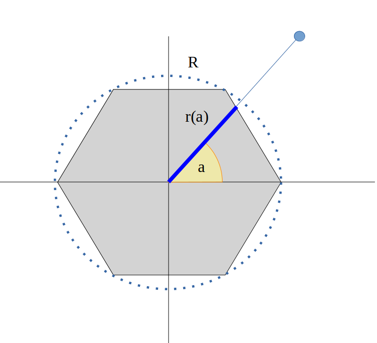
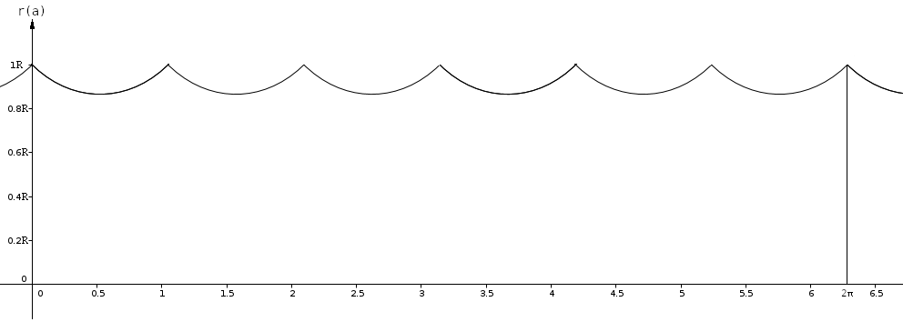
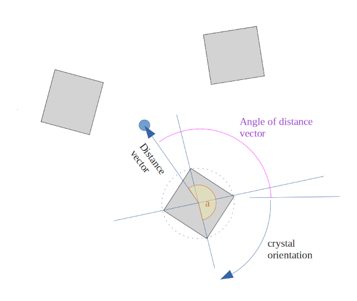

# Crystal Growth Simulation
December 2022

Program output 

---

## Motivation
A close look at polycrystalline Materials under the microscope (especially with polarized light) often reveals impressing structures, where the individual crystals are visible and gives insights into the conditions under which the formation took place.

Crystal structure of quartz rich marble. 
Source:  Strekeisen, CC BY-SA 4.0 <https://creativecommons.org/licenses/by-sa/4.0>, via Wikimedia Commons

Voronoi diagrams provide a very simple model to describe the growth and formation of the grain boundaries as seen in the pictures above. From each randomly scattered seed, a voronoi cell expands circular in all directions, and halts growth in a certain direction when it collides with a nother cell there. 

However, this model neglects some important behaviours: First, crystals are anisotropical and dont grow as circles. Second, the growth speed increases the larger a seed has already grown, as the Energy required to expand the crystal against its surface tension becomes less significant.

Hence, **this Program implements Voronoi Diagrams with polygonal growing seeds instead of circular growing ones** . The result is saved as a gif file.

## How it works
We start with an n x n grid (Parameter SIZE = n) and randomly select m pixels (Parameter SEEDS = m) on that grid. These are our crystal seeds! We create a list where we store them:
crystals = [ [x1,y1], [x2,y2],..]. 

By default, an empty pixel on the grid has the value -m, in order to enhance the contrast when plotting. An occupied pixel is assigned the index of the respective crystal.

Now we let these seeds grow, step by step. Initially, we start with the Radius R=0. With every step, we scan every pixel from left to right (0<=j<n), line by line (0<=i<n). We check every pixel at the position [j,i] if it's distance to any seed in the crystal list is smaller than the current Radius R. If so, the pixel will be assigned the index of the respective seed.  

In the picture below, we see such an assignment for a pixel. The crystal radius is R=2 already. A loop computes the distance to each seed and checks if the distance <= R. If so, the loop breaks. This means that the regarded pixel in our example is assigned the value 0 and not 2-

The growth is completed when the sum of the grid doesnt change anymore. However, due to the discretization, it might happen at the beginning that the sum doesnt change at first. To solve this, we require R to be greater than a treshold T. We choose T= (SIZE² / SEEDS)^1/2, which is the average Radius of a crystal, when the full area is divided equally by all crystals.

So far, this is the procedure to create a voronoi diagram with radial expanding cells. We now have to generalize the program to let the expanding cells have an arbitirary polygonal shape, where radial expanding cells are a special case for an infinite number of edges. 

The parameter SHAPE determines how many edges the polygons should have. 

Also, we need one more variable in our list of crystal seeds: the angle a of orientation!
crystals = [ [x1,y1,φ1], [x2,y2,φ2],..]. 
We use random numbers here, from 0 to 2 pi. 

While the range of a growing cell was solely described by R so far. But for the polygon, R describes the radius of the circumscribed circle. The extend of the cell depends on the direction.

This function r(a) is periodic, which means that we can take advantage of the property r(a)=r(a-pi*(k-2)/2k) with k being an integer. 
Note that a is the angle in the crystal's coordinate system. It is obtained by substracting the orientation angle φ from the absolute angle of the distance vector. 

Using trogonometric functions, we get:
$$r(a) = \sqrt{ ({R tan(b)\over tan(a)+tan(b)})^2 + ({R tan(a) tan(b) \over {tan(a) + tan(b)}})^2}$$

with

$$ a = \theta - \phi $$

a  relative angle of the distance vector

θ  absolute angle of the distance vector

φ  angle of the crystal orientation

and

$$b = {\pi * (SHAPE - 2)} \over {2 * SHAPE}  $$

## Todo
- [ ] Individual growth speeds depending on the crystal's size
- [ ] Historigram of the crystal size distribbution
- [ ] Binary phases
- [ ] Spontaneous formation of new seeds midst growth

## References

