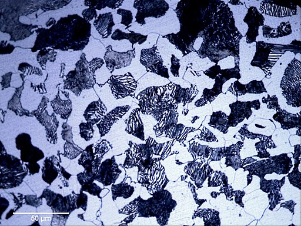

# Crystal Growth Simulation

## Motivation
A close look at polycrystalline Materials under the microscope (especially with polarized light) often reveals impressing structures, where the individual crystals are visible and gives insights into the conditions under which the formation took place.

Crystal Structure of Pearlite and Ferrite in Steel 

Source: Samson00, CC BY-SA 3.0 <https://creativecommons.org/licenses/by-sa/3.0>, via Wikimedia Commons

Crystal structure of quartz rich marble. 

Source:  Strekeisen, CC BY-SA 4.0 <https://creativecommons.org/licenses/by-sa/4.0>, via Wikimedia Commons
---
## How it works
sfsdf

## Todo
ffsdsdf

## References

